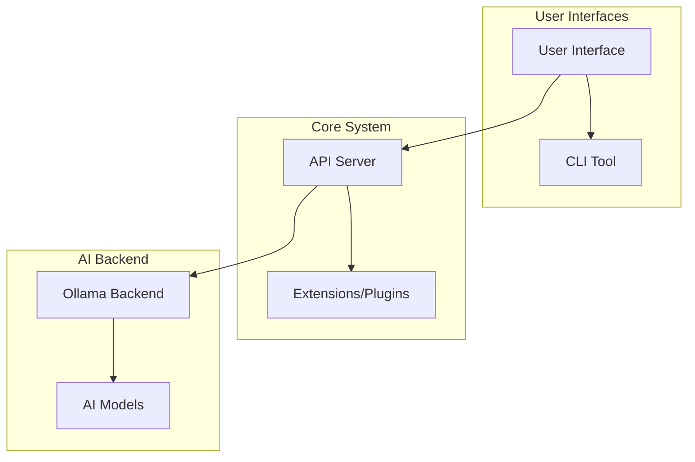

# Full Local AI System Plan

## System Overview
A complete local AI platform using Ollama and open-source models for chat, coding, APIs, and web apps. Runs 100% locally with no cloud dependency.

## Architecture



### Components:
1. **API Server**: FastAPI-based server providing OpenAI-compatible endpoints and custom features
2. **Web Interface**: HTML/JS chat interface for web-based interaction
3. **CLI Tool**: Command-line interface for direct AI assistant usage
4. **Ollama Integration**: Direct integration with local Ollama instance
5. **Model Management**: Configuration and switching between different AI models
6. **Extensions System**: Plugin architecture for additional features

## Technology Stack
- **Backend**: Python 3.9+, FastAPI, Uvicorn
- **AI**: Ollama with Qwen2.5-Coder and DeepSeek models
- **Frontend**: HTML5, JavaScript (vanilla), CSS
- **CLI**: Python Click or argparse
- **Deployment**: Standalone Python application

## Project Structure
```
localai/
├── src/
│   ├── api/
│   │   ├── main.py          # FastAPI server
│   │   ├── routes/
│   │   └── middleware/
│   ├── cli/
│   │   └── cli.py           # CLI tool
│   ├── web/
│   │   ├── static/
│   │   ├── templates/
│   │   └── app.py
│   ├── models/
│   │   └── config.py        # Model management
│   ├── extensions/
│   │   └── __init__.py
│   └── utils/
├── tests/
├── docs/
├── requirements.txt
├── README.md
└── setup.py
```

## Supported Models
- qwen2.5-coder:1.5b-base (lightweight coding)
- qwen2.5-coder:3b (balanced)
- qwen2.5-coder:latest (advanced)
- deepseek-coder:6.7b-instruct-q4_0 (coding + reasoning)

## Key Features
- OpenAI-compatible API for seamless integration
- Web-based chat interface
- CLI for scripting and automation
- Model switching and management
- Extensible plugin system
- Offline operation
- Cross-platform support

## Implementation Phases
1. Core API server with Ollama integration
2. Web interface development
3. CLI tool implementation
4. Model configuration system
5. Extensions framework
6. Testing and documentation
7. Packaging for distribution