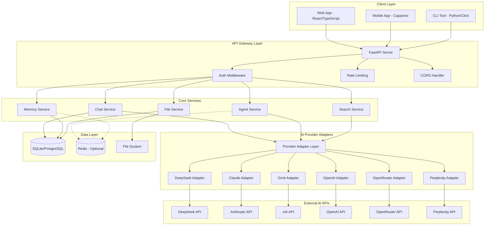
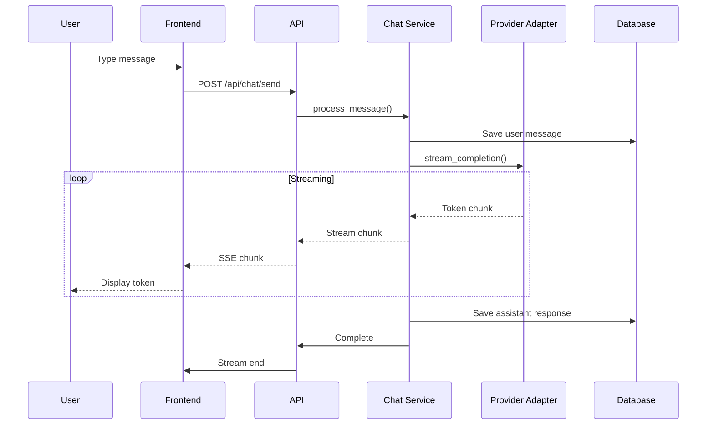
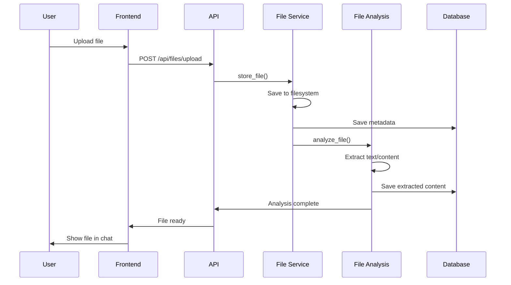
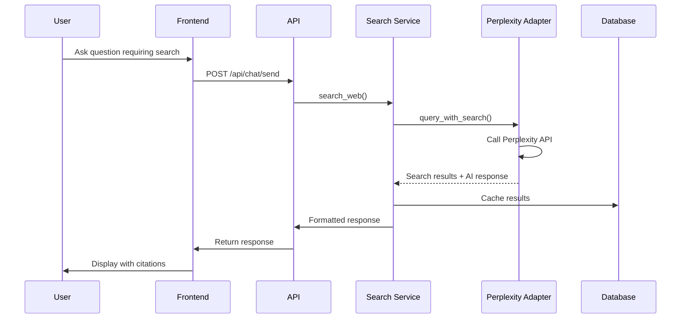
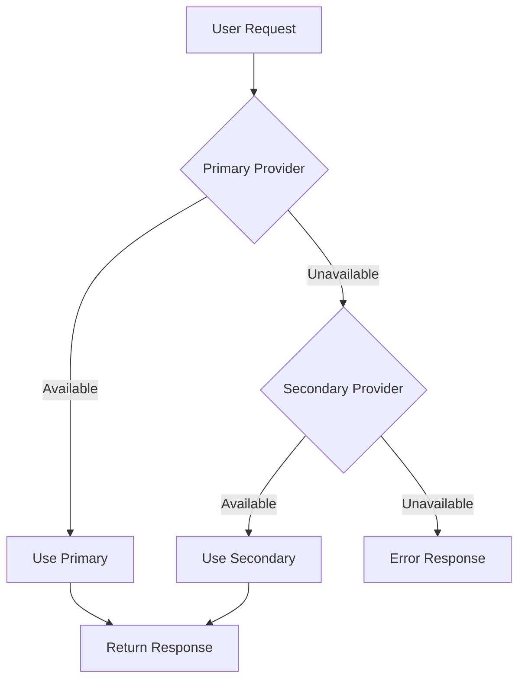

# GenZ Smart - System Architecture

## Overview

GenZ Smart is a premium AI personal assistant application with multi-provider AI integration, supporting web and mobile platforms. The architecture follows a clean separation between frontend, backend, and AI provider integrations, with a focus on scalability, security, and extensibility.

## System Architecture Diagram



## Component Architecture

### 1. Client Layer

#### Web Application (React + TypeScript)
- **Framework**: React 18+ with TypeScript
- **State Management**: Zustand for global state, React Query for server state
- **Routing**: React Router v6
- **UI Library**: Tailwind CSS + Headless UI
- **Markdown Rendering**: React-Markdown with remark-gfm
- **Code Highlighting**: PrismJS or Shiki
- **Animations**: Framer Motion

**Key Features**:
- Responsive chat interface
- Provider selection dropdown
- File upload with drag-and-drop
- Settings panel for API keys
- Dark/Light mode toggle
- Real-time streaming responses

#### Mobile Application (Capacitor)
- **Wrapper**: Capacitor 5+ wrapping the React web app
- **Native Plugins**: Camera, File System, Storage
- **Platform**: Android APK (Phase 2)

#### CLI Tool (Python)
- **Framework**: Click
- **Features**: Chat, model management, health checks
- **Configuration**: Local config file for API keys

### 2. API Gateway Layer (FastAPI)

**Responsibilities**:
- Request routing and validation
- Authentication and authorization
- Rate limiting
- CORS handling
- Request/Response logging
- Error handling and standardized responses

**Middleware Stack**:
1. CORS Middleware
2. Rate Limiting Middleware
3. Authentication Middleware
4. Request Logging Middleware
5. Error Handling Middleware

### 3. Core Services

#### Chat Service
- Manages conversation lifecycle
- Handles message streaming
- Coordinates with AI providers
- Manages conversation context

**Key Methods**:
- `create_conversation()`
- `send_message()`
- `stream_response()`
- `get_conversation_history()`
- `delete_conversation()`

#### Agent Service
- Orchestrates tool usage
- Manages agent capabilities (web search, file analysis)
- Handles multi-step reasoning
- Integrates with memory for context

**Capabilities**:
- Web Search (via Perplexity or SerpAPI fallback)
- File Analysis (PDF, TXT, images)
- Code Generation and Execution
- Task Automation

#### Memory Service
- Long-term conversation storage
- User preferences and settings
- Semantic search over past conversations (optional)
- Context window management

**Features**:
- Conversation persistence
- User preference learning
- Context summarization for long conversations

#### File Service
- File upload and storage
- File parsing and extraction
- Image processing
- Document analysis coordination

**Supported Formats**:
- Text: TXT, MD, CSV, JSON
- Documents: PDF, DOCX
- Images: PNG, JPG, WEBP
- Archives: ZIP (extract and analyze)

#### Search Service
- Web search integration
- Search result formatting
- Caching of search results
- Fallback mechanisms

**Providers**:
- Primary: Perplexity API (has built-in search)
- Fallback: SerpAPI or direct search APIs

### 4. AI Provider Adapters

The adapter pattern provides a unified interface for all AI providers.

#### Base Adapter Interface
```python
class BaseAIProvider(ABC):
    @abstractmethod
    async def chat_completion(self, messages: list, **kwargs) -> AsyncGenerator[str, None]:
        pass
    
    @abstractmethod
    async def check_health(self) -> bool:
        pass
    
    @property
    @abstractmethod
    def supports_streaming(self) -> bool:
        pass
    
    @property
    @abstractmethod
    def supports_vision(self) -> bool:
        pass
    
    @property
    @abstractmethod
    def supports_search(self) -> bool:
        pass
```

#### Provider-Specific Adapters

**DeepSeek Adapter**:
- API: DeepSeek Chat API
- Models: deepseek-chat, deepseek-coder
- Features: Streaming, function calling

**Claude Adapter**:
- API: Anthropic Messages API
- Models: claude-3-opus, claude-3-sonnet, claude-3-haiku
- Features: Streaming, vision, tool use

**Grok Adapter**:
- API: xAI API
- Models: grok-1, grok-1-vision
- Features: Streaming, vision

**OpenAI Adapter**:
- API: OpenAI Chat Completions API
- Models: gpt-4, gpt-4-turbo, gpt-3.5-turbo
- Features: Streaming, vision, function calling, tools

**OpenRouter Adapter**:
- API: OpenRouter API
- Models: Access to multiple providers through single endpoint
- Features: Model routing, streaming

**Perplexity Adapter**:
- API: Perplexity API
- Models: llama-3.1-sonar-small, llama-3.1-sonar-large
- Features: Built-in web search, citations

### 5. Data Layer

#### Database (SQLite/PostgreSQL)

**SQLite**: Default for local/single-user deployment
- Zero configuration
- File-based storage
- Perfect for personal use

**PostgreSQL**: Optional for production/multi-user
- Better concurrency
- Full-text search capabilities
- Scalability

**Migration Strategy**:
- Use SQLAlchemy ORM for database abstraction
- Alembic for migrations
- Environment variable to switch between SQLite and PostgreSQL

#### File System
- Local storage for uploaded files
- Organized by user/conversation
- Configurable storage path

#### Redis (Optional)
- Session caching
- Rate limiting counters
- Temporary data storage

## Data Flow

### Chat Flow


### File Upload Flow


### Web Search Flow


## Security Architecture

### API Key Management
- **Storage**: Environment variables or encrypted config file
- **Encryption**: AES-256 for config file storage
- **Access**: Never expose keys to frontend, proxy through backend

### Authentication (Future-Ready)
- **Current**: Single-user, API key based
- **Future**: JWT tokens for multi-user support
- **Session**: Secure HTTP-only cookies

### Data Protection
- **At Rest**: Database encryption for sensitive data
- **In Transit**: HTTPS/TLS for all communications
- **Files**: Scan uploads for malware, size limits

### Rate Limiting
- Per-endpoint rate limits
- Provider API quota management
- User-level throttling (future)

## Scalability Considerations

### Horizontal Scaling
- Stateless API design
- External session storage (Redis)
- Load balancer ready

### Database Scaling
- Read replicas for query-heavy operations
- Connection pooling
- Query optimization

### Caching Strategy
- Redis for:
  - Conversation summaries
  - Search results
  - User preferences
  - Provider health status

## Error Handling & Fallbacks

### Provider Fallbacks


### Error Categories
1. **Provider Errors**: Timeout, rate limit, API error
2. **Service Errors**: Database connection, file system
3. **Validation Errors**: Invalid input, file too large
4. **System Errors**: Memory, disk space

### Recovery Strategies
- Automatic retry with exponential backoff
- Circuit breaker pattern for failing providers
- Graceful degradation (reduce features)
- User notification of issues

## Technology Stack Summary

| Layer | Technology |
|-------|------------|
| Frontend | React 18, TypeScript, Tailwind CSS, Vite |
| Mobile | Capacitor 5 |
| Backend | Python 3.11+, FastAPI, Uvicorn |
| Database | SQLite (default), PostgreSQL (optional) |
| ORM | SQLAlchemy 2.0, Alembic |
| Cache | Redis (optional) |
| HTTP Client | HTTPX |
| Validation | Pydantic v2 |
| Testing | pytest, pytest-asyncio |
| Documentation | OpenAPI/Swagger |

## Directory Structure

```
genz-smart/
├── backend/
│   ├── src/
│   │   ├── api/
│   │   │   ├── __init__.py
│   │   │   ├── main.py
│   │   │   ├── dependencies.py
│   │   │   ├── middleware/
│   │   │   │   ├── __init__.py
│   │   │   │   ├── auth.py
│   │   │   │   ├── rate_limit.py
│   │   │   │   └── error_handler.py
│   │   │   └── routes/
│   │   │       ├── __init__.py
│   │   │       ├── chat.py
│   │   │       ├── files.py
│   │   │       ├── providers.py
│   │   │       ├── settings.py
│   │   │       └── health.py
│   │   ├── core/
│   │   │   ├── __init__.py
│   │   │   ├── config.py
│   │   │   ├── security.py
│   │   │   └── exceptions.py
│   │   ├── services/
│   │   │   ├── __init__.py
│   │   │   ├── chat_service.py
│   │   │   ├── agent_service.py
│   │   │   ├── memory_service.py
│   │   │   ├── file_service.py
│   │   │   └── search_service.py
│   │   ├── providers/
│   │   │   ├── __init__.py
│   │   │   ├── base.py
│   │   │   ├── deepseek.py
│   │   │   ├── claude.py
│   │   │   ├── grok.py
│   │   │   ├── openai.py
│   │   │   ├── openrouter.py
│   │   │   └── perplexity.py
│   │   ├── models/
│   │   │   ├── __init__.py
│   │   │   ├── database.py
│   │   │   ├── schemas.py
│   │   │   └── enums.py
│   │   └── utils/
│   │       ├── __init__.py
│   │       ├── file_parser.py
│   │       └── helpers.py
│   ├── tests/
│   ├── alembic/
│   ├── requirements.txt
│   └── Dockerfile
├── frontend/
│   ├── src/
│   │   ├── components/
│   │   │   ├── Chat/
│   │   │   ├── Layout/
│   │   │   ├── Settings/
│   │   │   └── UI/
│   │   ├── hooks/
│   │   ├── stores/
│   │   ├── services/
│   │   ├── types/
│   │   ├── utils/
│   │   ├── App.tsx
│   │   └── main.tsx
│   ├── public/
│   ├── package.json
│   └── vite.config.ts
├── mobile/
│   ├── capacitor.config.ts
│   └── android/
├── docs/
├── scripts/
└── docker-compose.yml
```

## Deployment Options

### Local Development
```bash
# Backend
pip install -r requirements.txt
uvicorn src.api.main:app --reload

# Frontend
cd frontend
npm install
npm run dev
```

### Docker Deployment
```yaml
# docker-compose.yml
version: '3.8'
services:
  backend:
    build: ./backend
    ports:
      - "8000:8000"
    volumes:
      - ./data:/app/data
      - ./uploads:/app/uploads
  frontend:
    build: ./frontend
    ports:
      - "3000:80"
    depends_on:
      - backend
```

### Production Deployment
- Backend: VPS or cloud VM (AWS EC2, DigitalOcean, etc.)
- Frontend: Static hosting (CDN) or served by backend
- Database: Managed PostgreSQL (AWS RDS, etc.)
- Files: Object storage (S3-compatible)
